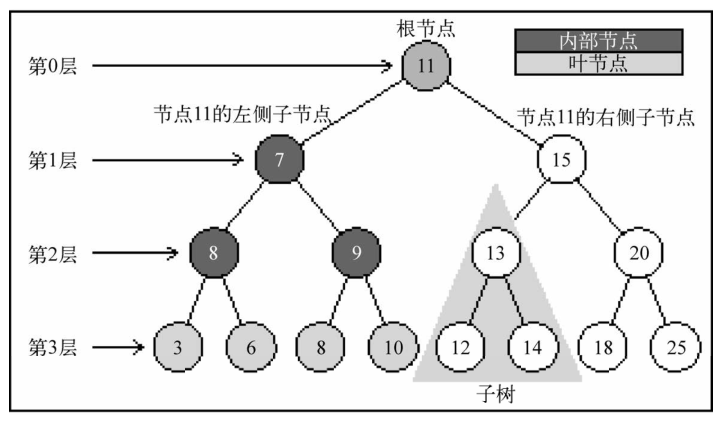
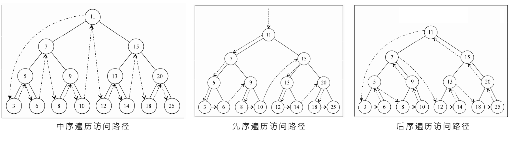

# 树
是一种非顺序数据结构，对存储需要快速查找的数据非常有作用。


## 基础知识



- 一个树结构包括一系列存在父子关系的节点。
- 位于树顶部的节点叫做根节点，至少有一个子节点的节点称为内部节点，没有子元素的节点称为外部节点或叶节点。
- 一个节点可以有祖先和后代，节点的祖先包括父节点、祖父节点、曾祖父节点等。节点的后代包括子节点、孙子节点、曾孙节点等。
- 子树由节点和它的后代节点组成，如节点 13、12 和 14 构成了节点 15 的子树。
- 节点的深度指它祖先节点的数量，如节点 3 有三个祖先节点，所以深度是 3。
- 树的高度取决于所有节点深度最大值，树也可以被划分层级，根节点在 0 层，它的子节点在 1 层，以此类推。


## 二叉搜索树

二叉搜索树是二叉树的一种，它只允许你在左侧节点存储比父节点小的值，右侧节点存储比父节点大或等于的值。

### 实现一个二叉搜索树

```js
function binarySearchTree() {
  // 声明树中的节点
  var Node = function(key) {
    this.key = key;
    this.left = null;
    this.right = null;
  }
  // 声明根节点
  this.root = null;

  // 实现向树中插入一个键方法
  this.insert = function(key) {
    // 新建节点
    var newNode = new Node(key);

    // 插入的节点为树的第一个节点的话
    if(this.root === null) {
      this.root = newNode;
    } else {
      // 插入节点为非根节点，需要使用辅助函数
      insertNode(this.root, newNode);
    }
  }

  // 辅助函数
  var insertNode = function(node, newNode) {
    // 新节点比根节点小则放在节点左侧
    if(newNode.key < node.key) {
      if(node.left === null) {
        node.left = newNode;
      } else {
        // 左侧如果已经有节点了则循环使用辅助函数直到填入空节点
        insertNode(node.left, newNode);
      }
    } else {
      // 新节点比根节点大则放在节点右侧
      if(node.right === null) {
        node.right = newNode;
      } else {
        // 右侧如果已经有节点了则循环使用辅助函数直到填入空节点
        insertNode(node.right, newNode);
      }
    }
  };


  // 实现中序遍历方法
  // 回调函数定义对遍历到的每个节点的操作
  this.inOrderTraverse = function(callback) {
    inOrderTraverseNode(this.root, callback);
  }

  // 辅助函数：通过判断传入节点是否为 null 来决定是否停止递归。
  // 先操作左侧小的子节点，再操作节点本身，最后操作右侧大的子节点。
  var inOrderTraverseNode = function(node, callback) {
    if(node !== null) {
      inOrderTraverseNode(node.left, callback);
      callback(node.key);
      inOrderTraverseNode(node.right, callback);
    }
  }

  // 先序遍历
  // 回调函数定义对遍历到的每个节点的操作
  this.preOrderTraverse = function(callback) {
    preOrderTraverseNode(this.root, callback);
  }

  // 辅助函数
  var preOrderTraverseNode = function(node, callback) {
    callback(node.key);
    preOrderTraverseNode(node.left, callback);
    preOrderTraverseNode(node.right, callback);
  }

  // 后序遍历
  this.postOrderTraverse = function(callback) {
    postOrderTraverseNode(this.root, callback);
  }

  // 辅助函数
  var postOrderTraverseNode = function(node, callback) {
    postOrderTraverseNode(node.left, callback);
    postOrderTraverseNode(node.right, callback);
    callback(node.key);
  }

  // 搜索最小值
  // min 方法暴露给用户，这个方法调用 minNode 方法
  this.min = function() {
    return minNode(this.root);
  }

  // 遍历树的左边直到找到树的最下层
  var minNode = function(node) {
    if(node) {
      while(node && node.left) {
        node = node.left;
      }
      return node.key;
    }

    return null;
  }

  // 同理搜索最大值
  this.max = function() {
    return maxNode(this.root);
  }

  var maxNode = function(node) {
    if(node) {
      while(node && node.right) {
        node = node.right;
      }
      return node.key;
    }

    return null;
  }

  // 搜索特定的值
  this.search = function(key) {
    return searchNode(this.root, key);
  }

  // 辅助函数
  var searchNode = function(node, key) {
    if(node === null) {
      return false
    }
    if (key < node.key) {
      return searchNode(node.left, key)
    } else if (key > node.key) {
      return searchNode(node.right, key)
    } else {
      return true
    }
  }

  // 移除一个节点
  this.remove = function(key) {
    root = removeNode(this.root, key);
  }

  // 辅助函数2
  var findMinNodeKey = function(node) {
    return minNode(node);
  }

  // 辅助函数1
  var removeNode = function(node, key) {
    if(node === null) {
      return null;
    }
    if(key < node.key) {
      node.left = removeNode(node.left, key);
      return node;
    } else if(key > node.key) {
      node.right = removeNode(node.right, key);
      return node;
      // key 等于 node.key 时，分三种情况
    } else {
      // 1. node 是一个叶节点
      if(node.left === null && node.right === null) {
        node = null;
        return node;
      }

      // 2. node只有一个子节点
      if(node.left === null) {
        node = node.right;
        return node;
      } else if (node.right = null) {
        node = node.left;
        return node;
      }

      // 3. node节点有两个子节点
      var aux = findMinNodeKey(node.right);
      node.key = aux;
      node.right = removeNode(node.right, aux);
      return node;
    }
  }
}

```

注1：几种遍历方法的访问路径情况




