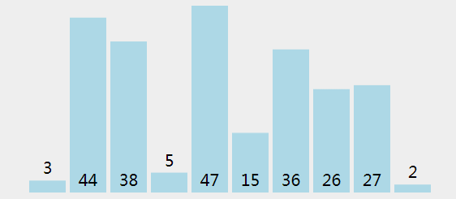

# 冒泡排序
## 原理
1. 待排序部分，第一个与第二个数据比较。
2. 如果第一个数据大于第二个，则二者交换位置。
3. 进行比较的数据位置向后移动一位。 
4. 重复 1-3 直到全部按照升序排好。



## JS代码实现
```js
// 模拟一个随机数组
var arr = [3,44,38,5,47,15,36,26,27,2];

// 设定交换位置函数
function swap(idx1, idx2){
	var change = arr[idx1];
	arr[idx1] = arr[idx2];
	arr[idx2] = change;
}

// 冒泡排序代码
function bubbleSort(arr){
	var length = arr.length;
	for(var i = 0; i < length - 1; i++){ // 数组经过了 i 轮排序,轮数为元素个数 -1。
		for(var j = 0; j < length -1 -i; j++){ // 每轮排序减掉 i,避免重复比较。
			if(arr[j] > arr[j+1]){ // 相邻元素比较
 				swap(j, j+1); // 交换元素
			}
		}
	}
	return arr;
}

bubbleSort(arr);
```