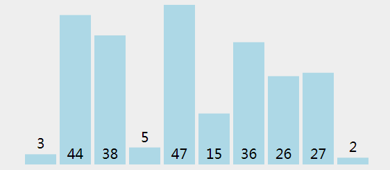

# 选择排序
## 原理
1. 待排序部分，找到最小元素。
2. 把该元素与待排序部分第一个交换位置。
3. 重复 1-2。



## JS代码实现
```js
// 模拟一个随机数组
var arr = [3,44,38,5,47,15,36,26,27,2];

// 交换位置函数
function swap(idx1, idx2){
	var change = arr[idx1];
	arr[idx1] = arr[idx2];
	arr[idx2] = change;
}

// 选择排序代码
function selectionSort(arr){
	var length = arr.length,
	indexMin;
	for(var i = 0; i<length -1; i++){ // 数组经过了 i 轮选择排序,轮数为元素个数 -1
		indexMin = i; // 假设待排序第一个元素索引 i 就是最小值的索引，保存到 indexMin
		for(var j = i + 1; j<length; j++){ // 遍历待排序元素的索引
			if(arr[indexMin] > arr[j]){ // 若发现新的最小值
				indexMin = j; // 更改最小值所在的索引 indexMix
			}
		}
		if(i !== indexMin){ // 若元素索引 i 不是数组最小值的索引
			swap(i, indexMin); // 交换两元素位置
		}
	}
	return arr;
}

selectionSort(arr);
```